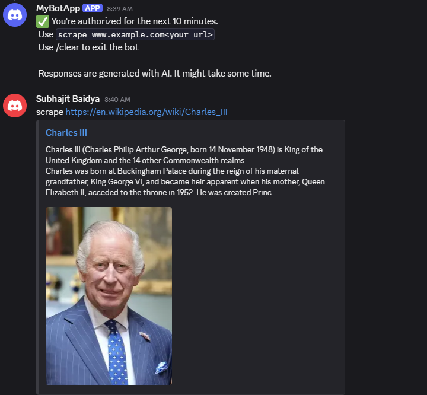
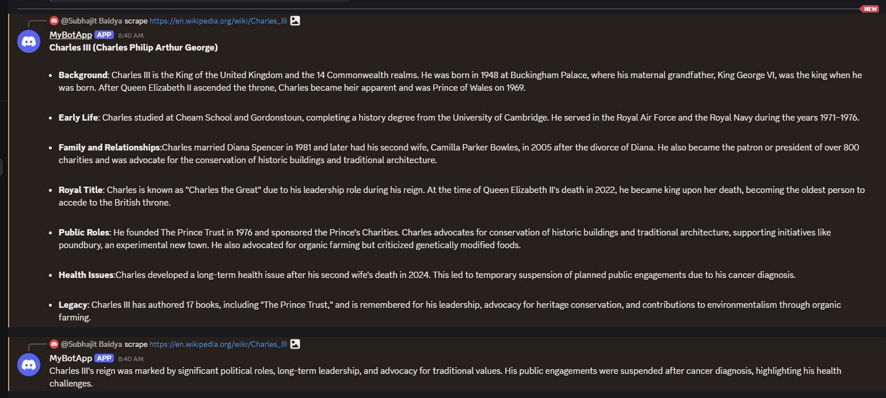

# 📌 Discord Bot

An interactive discord bot to communicate with users and scrape text data from public websites. 

---

## 🚀 Features

- ✅ The bot can scrape text data from any website and summarize the data using DeepSeek R1 model. 
- ✅ Summaries are sent as responses in chunks as discord bot replies. 
- ✅ API access for generated data

---

## 📸 Demo






---

## 🛠️ Tech Stack

**Server  and Libraries:** Node.js, Express.js, Discord.js, Cheerio
**Database:** MongoDB
**Others:** Docker, etc.

---

## 📦 Installation

Go to discord and create a server and bot
Use the bot token in order to interact with the bot using Node Js. 


Clone the repo:

```bash
git clone https://github.com/subhajitbaidya/discord-bot.git
cd discord-bot
npm install

set up environment variables in .env file


```

## 📗 Useful Docs to read: 
Cheerio: [Document Loading](https://cheerio.js.org/docs/intro)
DiscordJs: [Interacting with discord bot](https://discord.js.org/docs/packages/discord.js/14.19.3)
Ollama: [For ml models to run locally](https://ollama.com/)

## Future Implementations
- Deploy the bot
- Create authorization to access API
