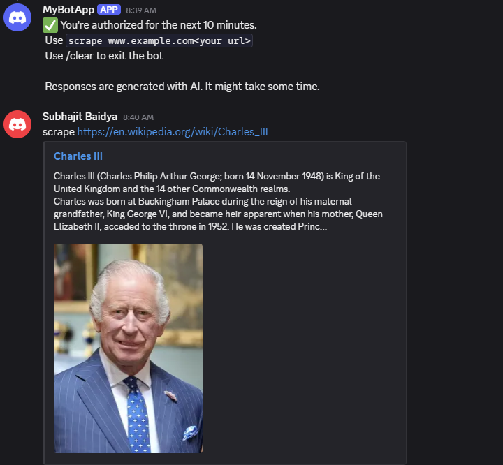
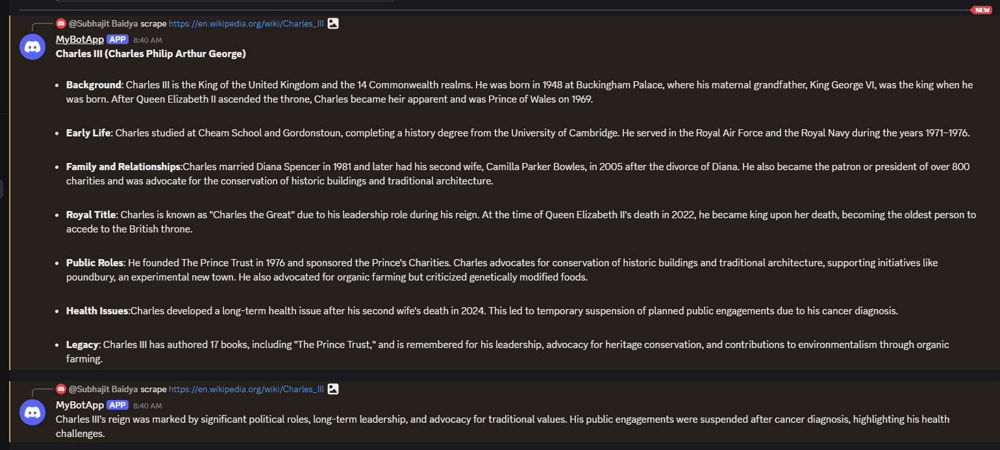

# 📌 Discord Bot

An interactive discord bot to communicate with users and scrape text data from public websites.

---

## 🚀 Features

- ✅ The bot can scrape text data from any website and summarize the data using DeepSeek R1 model.
- ✅ Summaries are sent as responses in chunks as discord bot replies.
- ✅ API access for generated data

---

## 📸 Demo

**User Asking the query**
<br>



**LLM response**
<br>



---

## 🛠️ Tech Stack

**Server and Libraries:** Node.js, Express.js, Discord.js, Cheerio
**Database:** MongoDB

---

## API Docs

- You can access the API endpoint at ```http://localhost:<your-port>/scrape``` to view the generated responses and can use it in other apps.
It is not deployed yet so please setup the local environment and access the endpoint. 
- Requests GET

___

## 📦 Installation

Go to discord and create a server and bot
Use the bot token in order to interact with the bot using Node Js.

Clone the repo:

```bash
git clone https://github.com/subhajitbaidya/discord-bot.git
cd discord-bot
npm install

set up environment variables in .env file


```

___

## 📗 Useful Docs to read:

Cheerio: [Document Loading](https://cheerio.js.org/docs/intro)
DiscordJs: [Interacting with discord bot](https://discord.js.org/docs/packages/discord.js/14.19.3)
Ollama: [For ml models to run locally](https://ollama.com/)

## Future Implementations

- Deploy the bot
- Create authorization to access API
- Set up Github Actions for CI/CD
